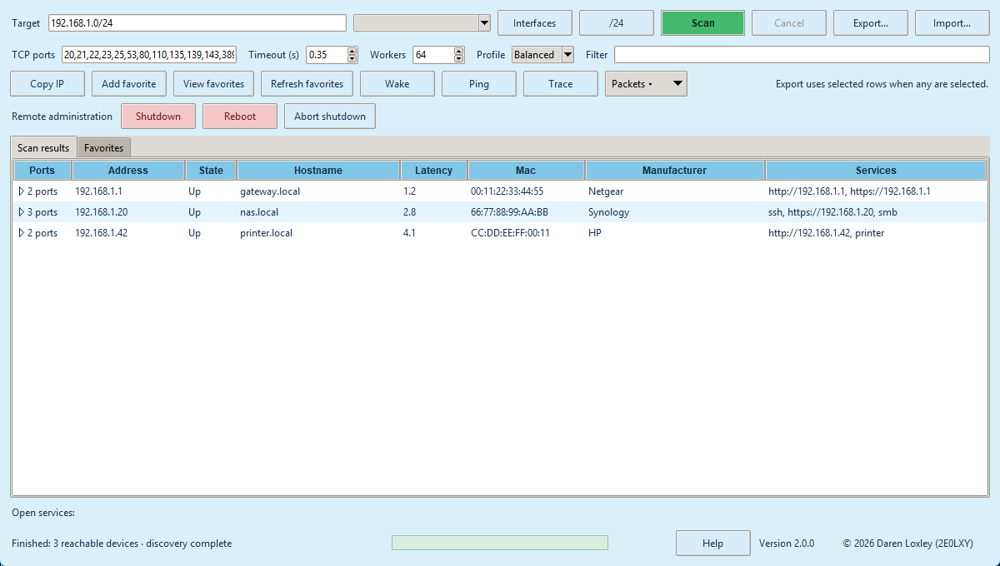
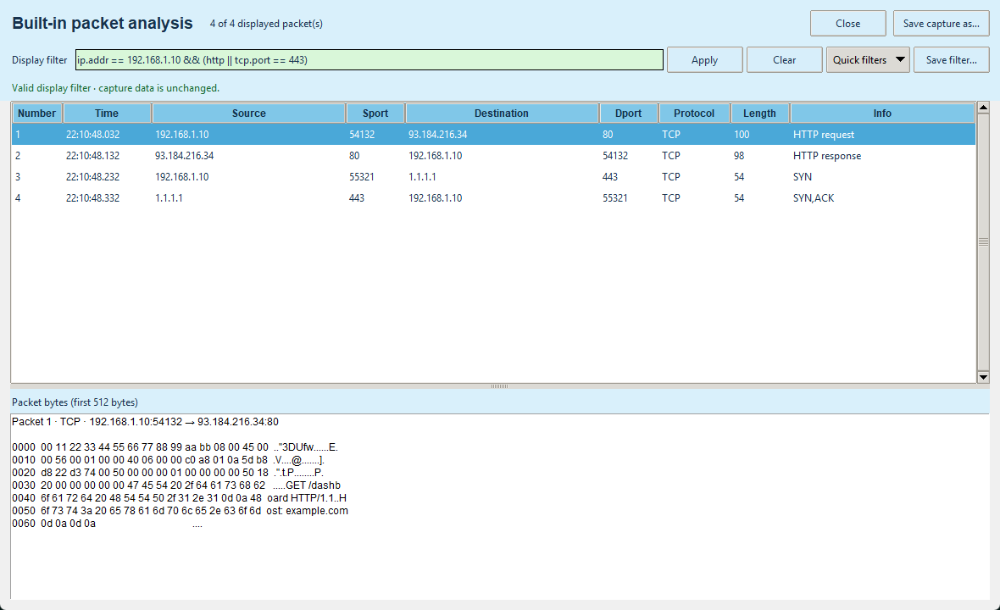
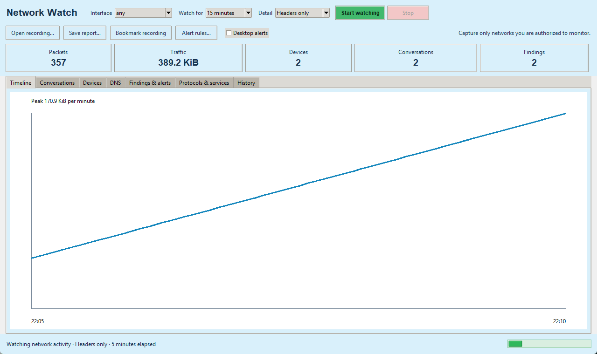
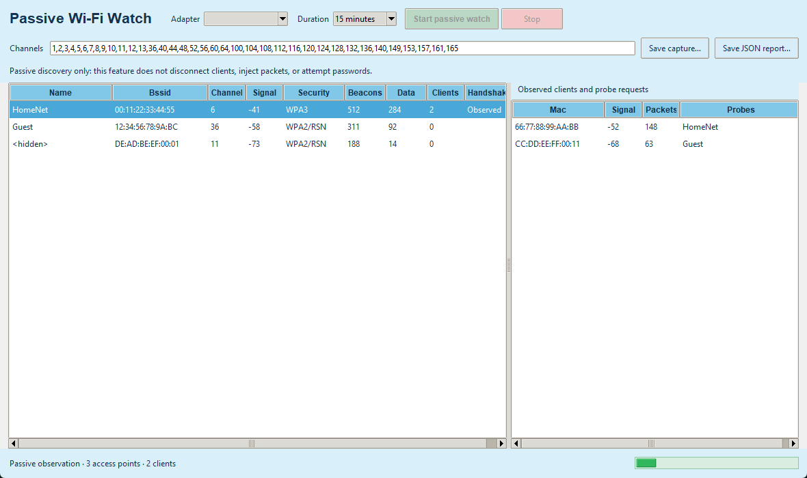
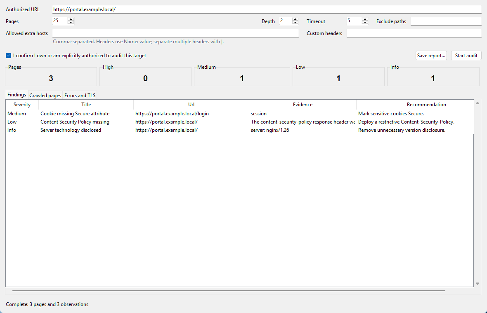

# Advanced IP Analyser 2.1.2 Instruction Book

Debian 13 edition

Copyright © 2026 Daren Loxley (2E0LXY)

Licensed GPL-3.0-or-later

## About this book

This book explains how to install, operate, update, troubleshoot, and safely
administer Advanced IP Analyser. It covers the graphical application, CLI,
packet display filters, Network Watch, and Passive Wi-Fi Watch.

Advanced IP Analyser is intended only for networks, devices, and radio traffic
you own or are explicitly authorized to inspect. The software does not grant
authorization and does not determine whether a particular capture is lawful.

## 1. What Advanced IP Analyser does

Advanced IP Analyser combines four workflows:

1. **Inventory:** find reachable IPv4/IPv6 devices and open TCP services.
2. **Administration:** save devices, exchange inventories, launch services,
   send Wake-on-LAN, and perform confirmed SSH power actions.
3. **Packet analysis:** capture a bounded host/service scope, open packet files,
   inspect metadata/bytes, and apply Wireshark-style display filters.
4. **Monitoring:** analyze traffic over time and passively observe compatible
   Wi-Fi monitor-mode traffic.

It is a focused Debian administration utility, not a complete protocol-forensics
suite. It does not decrypt TLS, reconstruct every application stream, exploit a
service, disconnect Wi-Fi clients, inject frames, or recover passwords.

## 2. System requirements

### Required

- Debian GNU/Linux 13 (Trixie), with a graphical desktop for the GUI.
- Python 3.11 or newer and Tk.
- `iproute2`, `iputils-ping`, `xdg-utils`, `pkexec`, and `python3-defusedxml`.
- Authorization for every network and device placed in scope.

### Optional

- `iw` and a compatible wireless adapter for Passive Wi-Fi Watch.
- `openssh-client` for SSH and remote power.
- `freerdp3-x11` for RDP.
- `gvfs-backends` for SMB browsing.
- `iputils-tracepath` and `telnet` for those diagnostic launchers.
- Debian IEEE or Nmap vendor data for offline MAC manufacturer names.
- `notify-send` for Network Watch desktop alerts.

## 3. Install and remove

### Install the release package

Download `advanced-ip-analyser_2.1.2_all.deb` from the project release page.
In a terminal:

```sh
cd ~/Downloads
sudo apt install ./advanced-ip-analyser_2.1.2_all.deb
```

Use `apt install ./file.deb`, not `dpkg -i`, because APT resolves dependencies.

Launch from the desktop menu or run:

```sh
advanced-ip-analyser-gui
```

The CLI executable is `advanced-ip-analyser`.

### Remove

```sh
sudo apt remove advanced-ip-analyser
```

APT removes application files but normally leaves per-user favorites, captures,
rules, history, bookmarks, and reports. Review the file locations in chapter 17
before manually removing personal data.

## 4. Main window tour



The main window is arranged from setup to action:

- **Target:** an address, inclusive range, or CIDR.
- **Interfaces:** refresh active IPv4 interface/subnet presets.
- **/24:** use the current host's class-C-style subnet.
- **TCP ports:** comma-separated ports and ranges.
- **Exclude:** optional addresses, ranges, or CIDRs removed from the target scope.
- **Repeat:** rescan every 5, 15, 30, or 60 minutes while the app remains open.
- **Timeout and Workers:** tune connection patience and concurrency.
- **Profile:** Fast, Balanced, or Accurate presets.
- **Filter:** live result-table text search.
- **Action row:** copy, favorites, Wake-on-LAN, Ping, Trace, and packet tools.
- **Remote administration:** Shutdown, Reboot, and Abort shutdown.
- **Scan results/Favorites:** inventory tables.
- **Footer:** status, centered green progress, Help, version, and Update.

## 5. Run a scan

### Choose a target

Accepted examples:

```text
192.168.1.20
192.168.1.10-192.168.1.50
192.168.1.0/24
2001:db8::10
2001:db8::/120
```

IPv4 CIDRs exclude network and broadcast addresses where applicable. Each scan
is limited to 65,536 expanded addresses.

### Choose ports and a profile

The default ports cover common web, file, mail, remote-access, database, printer,
and management services. Enter values such as:

```text
22,53,80,443,445,8000-8100
```

Right-click the port field for presets. An all-65,535-port scan is allowed only
after confirmation. Use it on one or a few targets, not a whole subnet.

- **Fast:** short timeout and higher concurrency.
- **Balanced:** suitable for normal local networks.
- **Accurate:** longer timeout and lower concurrency for slow/filtering networks.

### Start, follow, or cancel

Press **Scan** or `F5`. The first phase tests reachability and ports. Reachable
devices appear as they are discovered. The second phase inspects safe server
metadata for hosts with open ports. Its separate indicator prevents fingerprint
work from delaying the initial inventory.

Press **Cancel** or `Escape` to retain partial results and stop pending work.

## 6. Understand and use results

The host row shows address, state, hostname, latency, MAC, manufacturer, and
services. Click a heading to sort ascending; click again for descending.

Expand a host to see detected ports. Expand a port to see metadata such as:

- HTTP status, server/powered-by, content type, title, redirect, and realm;
- TLS protocol and cipher; or
- a bounded safe SSH, FTP, SMTP, POP3, or IMAP greeting.

After metadata discovery, the main table also shows a conservative device type,
operating system/version, and model when enough evidence is available. These are
heuristic inventory hints derived from manufacturer, ports, HTTP metadata, and
protocol banners. Exports include the values and confidence level; do not treat
them as authenticated hardware or software evidence.

Use the Filter field to search all visible host/service metadata. This is a table
search; packet display filters are a separate language described in chapter 11.

Open a supported service by double-clicking, pressing Enter, using the context
menu, or selecting a generated link. HTTP(S)/FTP use the desktop URL handler;
SMB uses the file manager; SSH/Telnet open a terminal; RDP uses FreeRDP.

## 7. Favorites and inventory exchange

Select host rows and press **Add favorite**. Favorites are identified by MAC
first, so a refreshed DHCP address does not lose the saved identity or note.

The Favorites tab supports:

- refresh/rescan;
- note editing;
- removal;
- export selected; and
- the same host actions available in scan results.

**Export** supports CSV, JSON, XML, and escaped HTML. When rows are selected,
only those rows are exported; otherwise all visible rows are exported. CSV text
that could become a spreadsheet formula is neutralized.

**Import** accepts only bounded Advanced IP Analyser JSON/XML. XML parsing blocks
entities/DOCTYPE and uses a hardened parser. Imported observations merge into the
visible inventory and favorites.

## 8. Wake, diagnostics, and remote services

### Wake-on-LAN

Select devices with MAC addresses and press **Wake**. The app selects a matching
active-interface broadcast where possible. Wake-on-LAN must also be enabled in
the target firmware/OS and may not cross routers.

### Ping and Tracepath

Select a host and use **Ping** or **Trace**. A Debian terminal opens with a fixed,
bounded command. No shell command is built from network data.

### Remote power

Shutdown and reboot use non-interactive OpenSSH and ask for confirmation. They
schedule the remote action one minute ahead so **Abort shutdown** can cancel it.
Configure SSH keys and narrowly scoped passwordless remote `sudo shutdown`
permission. The application never requests, retains, or forwards passwords.

## 9. Capture selected traffic

Select one or more host rows and choose **Packets → Capture selected
host/service**. Selecting one service row also restricts the capture to that port.

Choose a Linux interface (`any` is allowed) and 1-300 seconds. Live captures are
limited to 100,000 packets. The GUI stays unprivileged; when raw sockets are
denied, PolicyKit starts the installed root-owned helper. The helper validates
interface, addresses, port, duration, packet limit, output ownership, file type,
link count, and link type before writing.

The capture opens automatically in the packet viewer and can be saved elsewhere.

## 10. Open and inspect packet files

Use **Packets → Open capture file for selection**. If hosts or a service are
selected, the reader restricts results to that scope. It accepts:

- classic little/big-endian PCAP with micro/nanosecond timestamps;
- PCAPNG Ethernet interfaces; and
- gzip-compressed PCAP/PCAPNG.

Expanded input is limited to 512 MiB, 100,000 packets, and 262,144 bytes per
record. Unsupported or malformed structures are rejected.



Select a packet to inspect its summary and bounded hex/ASCII preview.

## 11. Display filters

Display filters change which existing packets appear. They never change what is
captured. Press Enter or **Apply**. Green means valid; red provides an error.

### Protocols and address fields

```text
ip
ipv6
tcp
udp
dns
http
http.request
http.response
https
tls
icmp || icmpv6
arp
ip.addr == 192.168.1.10
ip.src == 192.168.1.10
ip.dst == 8.8.8.8
ip.addr == 192.168.1.0/24
```

### Ports and TCP flags

```text
tcp.port == 443
tcp.srcport == 443
tcp.dstport == 22
udp.port == 53
tcp.flags.syn == 1
tcp.flags.syn == 1 && tcp.flags.ack == 0
tcp.flags.fin == 1 || tcp.flags.rst == 1
tcp.len > 0
```

### DNS, HTTP, and TLS

```text
dns.flags.response == 0
dns.flags.response == 1
dns.qry.name contains "example.com"
http.request.method == "GET"
http.host contains "example.com"
http.request.uri contains "/login"
http.response.code == 404
tls.handshake.type == 1
ssl.handshake.type == 1
```

### Size, text, and combinations

```text
frame.len > 1000
protocol != "arp"
dns.qry.name matches "^api\\.example\\.com$"
ip.addr == 192.168.1.10 && (http || dns)
!(ip.addr == 192.168.1.0/24)
```

Comparison operators are `==`, `!=`, `>`, `<`, `>=`, `<=`, `contains`, and
`matches`. Boolean operators are `&&`, `||`, `!`, and parentheses. Expressions,
tokens, nesting, text values, and regex features are bounded. Regex lookaround,
backreferences, groups, counted repetition, and heavy repetition are rejected.

The Quick filters menu provides 20 presets. Use **Save filter** to persist a
validated named expression.

## 12. Network Watch



Open **Packets → Network Watch**, choose an interface, duration, and detail:

- Headers only: 128 bytes per packet; recommended.
- Protocol details: 512 bytes per packet.
- Full packets: up to complete packet payloads.

Confirm the authorized capture. The progress indicator runs while the watch is
active and views refresh from the growing PCAP.

### Dashboard tabs

- **Timeline:** bytes per minute and peak traffic.
- **Conversations:** normalized bidirectional endpoints, ports, protocol,
  packets/bytes, duration, and health.
- **Devices:** sent/received bytes, peers, external peers, observed ports, and
  protocols.
- **DNS:** query/response names, devices, servers, and response codes.
- **Findings & alerts:** severity, category, subject, and explanation.
- **Protocols & services:** protocol-layer and port totals.
- **History:** previous session time, duration, packets, bytes, and recording.

### TCP health

Network Watch estimates resets, zero advertised windows, retransmissions,
out-of-order sequences, unanswered SYNs, and SYN-to-SYN/ACK handshake time.
Offloading, truncation, asymmetrical routing, or incomplete capture can affect
these estimates; use them as investigative leads.

### Findings and rules

Built-in findings include new saved-device baseline addresses, connection fan-out,
large traffic increases, repeated DNS failure, resets, retransmissions, unanswered
connections, ARP ownership changes, and unusually regular timing.

Use **Alert rules** to add:

- `new_device`;
- `traffic_bytes` threshold;
- `failed_connections` threshold;
- exact `destination` IP;
- observed `port`; or
- `dns_name` text.

Rules are bounded and stored atomically. Enable **Desktop alerts** to use
`notify-send` when available. Duplicate notifications are suppressed per window.

### Reports, bookmarks, retention

Save HTML, JSON, or conversation CSV reports. **Bookmark recording** copies the
PCAP and a bounded note to a protected bookmark directory. Ordinary Network Watch
captures and database history use seven-day retention; ordinary captures are also
limited to 250 MiB, deleting oldest first. The recording being finalized and
bookmarks are protected.

## 13. Passive Wi-Fi Watch



Install `iw`, attach a monitor-capable adapter, then open **Packets → Passive
Wi-Fi Watch**. Choose the adapter, duration, and channel list. Confirm the legal
scope and PolicyKit prompt.

The helper creates a temporary virtual interface named from the Linux interface
index, sets it up, and changes only its validated channel. It does not stop
NetworkManager, alter the managed interface MAC, or replace the base interface.
On stop it removes only the reserved monitor interface after verifying its type.

The window displays:

- SSID/BSSID and hidden SSIDs;
- channel and radiotap dBm signal where supplied;
- advertised Open, WEP, WPA, WPA2/RSN, or WPA3 information;
- beacon/data counts;
- associated client MACs;
- passive probe-request names; and
- whether EAPOL traffic was observed.

“EAPOL observed” is not a recovered key or password. Save the radiotap PCAP or a
JSON report if needed. Wi-Fi ordinary recordings use the same bounded retention.

Passive Wi-Fi Watch deliberately has no deauthentication, injection, rogue AP,
credential interception, key/password cracking, or denial-of-service capability.

## 14. Web Security Audit



Select a host with HTTP/HTTPS and press **Web audit**, or open the window and
enter a URL. Before **Start audit** is enabled, confirm that you own or are
explicitly authorized to test the site.

The audit is intentionally bounded and read-only:

- only `http://` and `https://` targets are accepted;
- credentials embedded in URLs are rejected;
- crawling remains on the initial hostname plus explicitly allowed hosts;
- maximum depth is 5, maximum pages is 100, each page is capped at 1 MiB, and
  the complete run is capped at 20 MiB;
- path prefixes can be excluded;
- custom headers can support an authorized test session, but unsafe transport
  headers and line breaks are rejected;
- `Authorization`, `Cookie`, and `Proxy-Authorization` remain bound to the
  original scheme, hostname, and port and are removed on cross-origin links or
  redirects; and
- the crawler uses `GET` and never submits forms or sends exploit payloads.

The **Findings** tab reports defensive observations such as cleartext HTTP,
missing security headers, cookie attributes, permissive CORS, technology
disclosure, mixed content, directory listing, and unsafe password-form methods.
The **Crawled pages** tab inventories status, URL, title, technologies, bytes,
links, and forms. **Errors and TLS** shows certificate validation, TLS protocol,
cipher, certificate SHA-256 fingerprint, and bounded request errors.

Save an escaped HTML report for people or structured JSON for other tools. This
module is not a clone of Acunetix/Invicti. It deliberately excludes active SQL
injection/XSS testing, credential attacks, forced browsing, file upload, malware
execution, destructive validation, and out-of-band exploit callbacks.

## 15. Automatic updates

The app checks the latest project GitHub release after startup. A newer valid tag
causes the footer button to flash. Click it and confirm to:

1. download only the exact expected release asset URL;
2. enforce a 50 MiB package limit;
3. verify GitHub's SHA-256 digest;
4. verify Debian Package and Version fields;
5. launch the detached helper and close the GUI;
6. wait for the old process to end;
7. ask PolicyKit to run `apt-get install`; and
8. reopen the application.

Help contains a manual **Check for updates** action. Never bypass an update
verification failure; use the Releases page and verify the checksum instead.

## 16. Command-line reference

### Scan

```sh
advanced-ip-analyser scan TARGET [--timeout SECONDS] [--workers COUNT] [--output FILE]
```

### Wake-on-LAN

```sh
advanced-ip-analyser wake MAC [--broadcast ADDRESS]
```

### Capture

```sh
advanced-ip-analyser capture TARGET [--interface NAME] [--port PORT] \
  [--duration SECONDS] [--max-packets COUNT] [--output FILE]
advanced-ip-analyser capture-interfaces
```

### Read/filter a capture

```sh
advanced-ip-analyser open-capture FILE [--host ADDRESS] [--port PORT] \
  [--limit COUNT] [--filter EXPRESSION]
```

### Monitor and report

```sh
advanced-ip-analyser watch [--interface NAME] [--duration SECONDS] \
  [--snaplen BYTES] [--report FILE]
advanced-ip-analyser analyse-capture FILE --report FILE
```

### Web security audit

```sh
advanced-ip-analyser web-audit https://server.example \
  --max-pages 25 --max-depth 2 --exclude /logout --report web-audit.html
```

## 17. Files, data, and privacy

| Path | Contents |
| --- | --- |
| `~/.config/advanced-ip-analyser/favorites.json` | Favorites and notes |
| `~/.config/advanced-ip-analyser/packet-filters.json` | Named display filters |
| `~/.config/advanced-ip-analyser/alert-rules.json` | Network Watch rules |
| `~/.cache/advanced-ip-analyser/` | Short-lived selected-host captures and update downloads |
| `~/.local/share/advanced-ip-analyser/network-watch.sqlite3` | Session history and baselines |
| `~/.local/share/advanced-ip-analyser/captures/` | Ordinary Network Watch PCAP |
| `~/.local/share/advanced-ip-analyser/bookmarks/` | Bookmarked PCAP and note JSON |
| `~/.local/share/advanced-ip-analyser/wifi-captures/` | Passive Wi-Fi PCAP |

The app has no analytics/telemetry endpoint. Local data leaves the computer only
through explicit export/copy or tools the user launches. Update checks contact
this project's GitHub Releases API.

## 18. Troubleshooting

### Scan finds nothing

- Check the interface subnet and target spelling.
- Try Accurate and increase timeout.
- Confirm the target is powered and routed.
- A firewall may block ping and TCP probes.

### Capture says the package must be installed

Privileged helpers are intentionally rejected from a source checkout because
their root ownership cannot be trusted. Install the official `.deb`.

### No Wi-Fi adapter appears

- Confirm the device exists under `/sys/class/net` and has a `wireless` directory.
- Install `iw`.
- Check adapter/driver monitor-mode and virtual-interface support.
- Some USB adapters need Debian firmware packages.

### Channel hopping fails

Remove channels unsupported by the adapter, driver, or regulatory domain. The
application does not override regulatory restrictions.

### Service action fails

Install the corresponding Debian client/desktop handler. SSH also requires a
valid remote username and normal remote authentication.

### Remote power fails

Test `ssh -o BatchMode=yes user@host` separately. Configure key authentication
and narrowly scoped passwordless `sudo shutdown` permission.

### Update does not appear

Use Help → Check for updates. Confirm GitHub connectivity. A release without the
expected filename or SHA-256 digest is deliberately ignored/rejected.

### Web audit finds no pages

Confirm the URL includes `http://` or `https://`, the hostname resolves, and the
site permits the configured user agent. Check excluded paths and allowed hosts.
An authentication redirect to another hostname requires that hostname to be
explicitly allowed. Interpret certificate trust separately from the TLS
protocol/cipher inventory; validation failures are shown as High findings.

## 19. Keyboard and mouse reference

| Input | Action |
| --- | --- |
| F5 | Scan |
| Escape | Cancel scan |
| Ctrl+F | Focus result filter |
| Ctrl+O | Import inventory |
| Ctrl+S | Export inventory |
| Ctrl+Shift+C | Copy selected detail |
| Enter | Open selected supported service |
| Double-click | Open service/preferred web service |
| Right-click result | Open, copy, expand/collapse |
| Right-click TCP ports | Port presets |

## 20. Security and interpretation notes

- Scan/fingerprint work is bounded and unauthenticated.
- Network-derived strings are not passed through a shell.
- SSH option injection is rejected and `--` terminates options.
- XML entities/DOCTYPE are rejected and defused parsing is used.
- CSV formula-leading values are neutralized.
- HTML report/inventory values are escaped.
- Favorites, filters, and rules use atomic replacement.
- Packet files, records, filters, expressions, regex, reports, history, captures,
  notifications, and Wi-Fi channel plans have explicit bounds.
- Elevated helpers validate fixed options and filesystem ownership.
- Web audits require explicit authorization, enforce same-host/allowed-host
  scope, bound pages/depth/bytes, and never submit forms or send exploit payloads.
- Update packages require both cryptographic digest and Debian identity checks.

Network Watch findings and Passive Wi-Fi security labels are observations. They
can be affected by partial visibility and should be confirmed with configuration,
logs, and authorized specialist tools before action.

## 21. Getting help and contributing

Use the in-app Help centre for offline guidance. For bugs, include Debian version,
application version, steps, expected/actual result, and sanitized logs/captures:

https://github.com/2E0LXY/Advanced-IP-Analyser/issues

Run tests before proposing source changes:

```sh
python3 -m unittest discover -s tests -v
python3 -m compileall -q src tests
```

The project is an independent GPL implementation and is not affiliated with
Angry IP Scanner, Famatech Advanced IP Scanner, Airgorah, or Wireshark.
